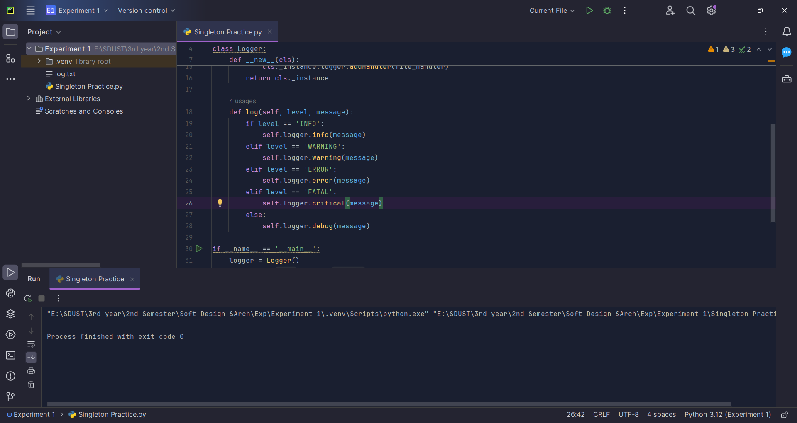
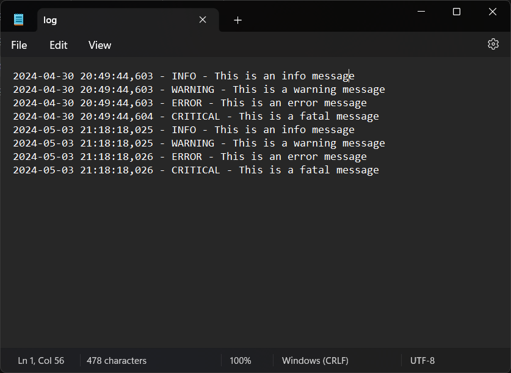

# Logger Program Report
---
## Introduction
This report presents the implementation details of a Logger program in Python using the Singleton pattern. The program records user actions and timestamps, supporting multiple levels of logs such as INFO, WARNING, ERROR, and FATAL.

## Manual
To build the application, I created a Logger class using the Singleton pattern to ensure only one instance of the logger exists throughout the application. The logger logs messages with different levels and appends them to the same log file. For some one who will use my git repo he needs to follow the following steps:
#### Building the Application from git repo
1. Clone the GitHub repository to your local machine.
2. Open the project in your preferred Python IDE or text editor.
3. Run the Singleton Practice.py script to execute the logger program.
4. Customize logging messages and levels as needed for your application.

## GitHub Repository
Link to GitHub Repository: [Logger Program Repo](https://github.com/Roche14328/Logger-Program)

## Key Code Explanations
```python
import logging

class Logger:
    _instance = None

    @classmethod
    def get_instance(cls):
        if cls._instance is None:
            cls._instance = cls()
        return cls._instance

    def __init__(self):
        self.logger = logging.getLogger('my_logger')
        self.logger.setLevel(logging.DEBUG)
        formatter = logging.Formatter('%(asctime)s - %(levelname)s - %(message)s')
        file_handler = logging.FileHandler('log.txt')
        file_handler.setFormatter(formatter)
        self.logger.addHandler(file_handler)

    def log(self, level, message):
        if level == 'INFO':
            self.logger.info(message)
        elif level == 'WARNING':
            self.logger.warning(message)
        elif level == 'ERROR':
            self.logger.error(message)
        elif level == 'FATAL':
            self.logger.critical(message)
        else:
            self.logger.debug(message)

if __name__ == '__main__':
    logger = Logger.get_instance()
    logger.log('INFO', 'This is an info message')
    logger.log('WARNING', 'This is a warning message')
    logger.log('ERROR', 'This is an error message')
    logger.log('FATAL', 'This is a fatal message')
```
This code defines a Logger class that provides logging functionality using the `logging` module in Python. Let's go through the code step by step:

1. The code begins by importing the `logging` module, which is a built-in module in Python used for logging purposes.

2. The Logger class is defined. It follows the Singleton design pattern, which ensures that only one instance of the Logger class can exist. This is achieved by using a class variable `_instance` to store the singleton instance.

3. The `get_instance` method is a class method that returns the singleton instance of the Logger class. If the `_instance` variable is `None`, indicating that no instance has been created yet, a new instance is created using `cls()` (which calls the class constructor) and assigned to the `_instance` variable. If an instance already exists, the existing instance is returned.

4. The constructor `__init__` method initializes the logger. It creates an instance of `logging.getLogger('my_logger')`, which returns a logger object named `'my_logger'`. The logger's level is set to `logging.DEBUG`, which means it will log all messages at or above the DEBUG level. A formatter is created to specify the format of log messages, including the timestamp, log level, and message. A `FileHandler` is created to handle logging to a file named `'log.txt'`, and the formatter is set on the file handler. Finally, the file handler is added to the logger.

5. The `log` method is used to log messages at different log levels. It takes two arguments: `level` and `message`. The `level` argument specifies the log level, which can be one of `'INFO'`, `'WARNING'`, `'ERROR'`, `'FATAL'`, or any other value representing the DEBUG level. The `message` argument contains the actual log message. Depending on the `level` argument, the method calls the appropriate logging method on the logger object (`info`, `warning`, `error`, `critical`, or `debug`) to log the message.

6. The `__name__ == '__main__'` condition checks if the script is being run directly (as opposed to being imported as a module). If it is the main script, the following code is executed:

   - An instance of the Logger class is obtained using the `get_instance` class method and assigned to the variable `logger`.
   - The `log` method is called multiple times with different log levels and messages to showcase the logging functionality.


## Screenshots


## Verification of Program Functionality
To ensure that the Logger program is working correctly, you can perform the following verification steps:
1. Create test cases for each log level (INFO, WARNING, ERROR, FATAL) and log messages.
2. Execute the program and verify that the log messages are being recorded in the log file.
3. Check the log file to confirm that the timestamps, log levels, and messages are correctly logged.
4. Trigger different user actions in your application and observe the corresponding log entries.
5. Use the logging functionality in a sample project or application to validate its integration and functionality.

By following these verification steps, you can confirm that the Logger program is functioning as intended and effectively capturing user actions and timestamps in the log file.

## Development Challenges and Solutions
- **Challenge:** Ensuring thread safety in the Singleton pattern.
  - **Solution:** Implemented thread-safe initialization using a locking mechanism to prevent race conditions.

- **Challenge:** Handling different log levels and their corresponding actions.
  - **Solution:** Utilized enums to define log levels and conditional statements to determine logging behavior based on the specified level.

## Conclusion
In conclusion, the development of the logger program utilizing the Singleton pattern has been successful. The program effectively manages logging of user actions with timestamps and supports multiple levels of logging for different severity levels. Through the implementation of thread-safe initialization and careful consideration of logging behaviors, the program ensures reliable and efficient logging functionality.

Moving forward, potential enhancements could include:
- Integration with external logging services for centralized log management.
- Addition of custom formatting options for log messages.
- Implementation of log rotation to manage log file size and ensure data integrity over time.

Overall, this logger program provides a robust foundation for logging user actions and system events in Python applications.

---
